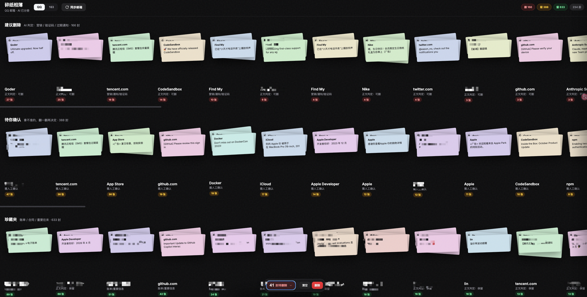
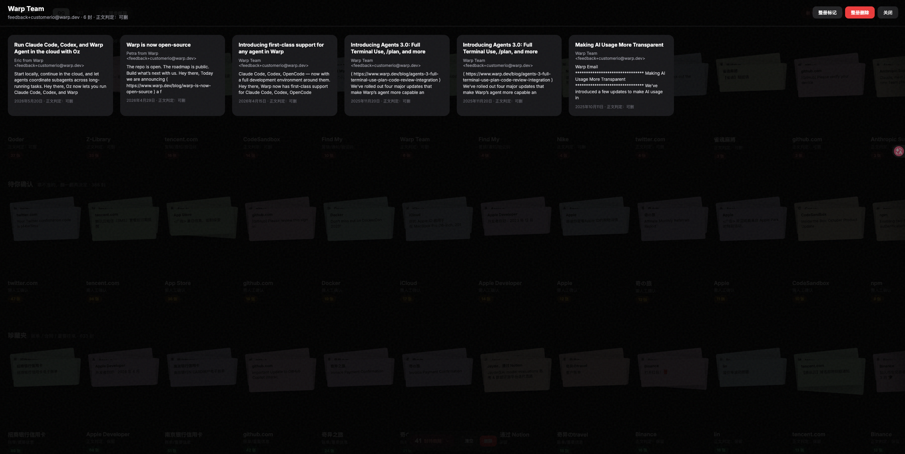
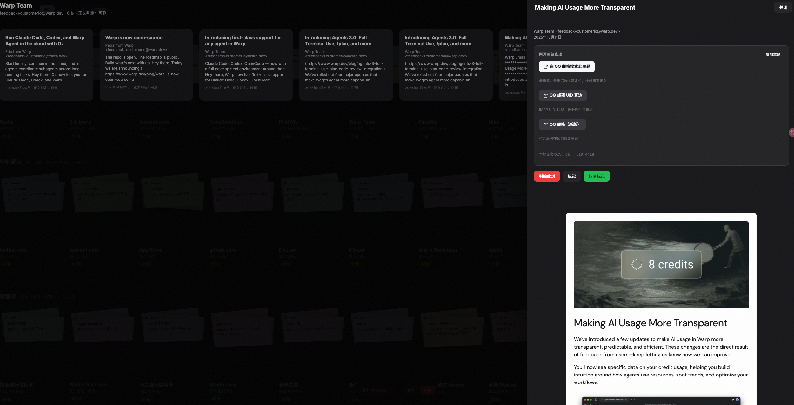

# 碎纸相簿 · netease-mail-cli

本地化的 **163 / QQ 邮箱** 管理工具：通过 IMAP 导出邮件、AI 智能分册、相册式可视化浏览，并支持在网页中批量标记与删除。

> 所有数据保存在本机 `data/` 目录，不经过第三方服务器。删除操作会直接作用于你的邮箱（请谨慎使用）。

---

## 功能概览

| 模块 | 说明 |
|------|------|
| **命令行 CLI** | 搜索、预览、按条件或 UID 删除邮件 |
| **邮件导出** | 将收件箱邮件下载为本地 JSON，支持断点续传 |
| **碎纸相簿（Web）** | 相册式 UI：按发件人分册、AI 建议删除 / 待确认 / 珍藏 |
| **同步邮箱** | 与 QQ/163 网页端对齐，移除已在网页删掉的本地缓存 |
| **网页内删除** | 自定义确认弹窗，支持整册删除、标记批量删除 |

### 界面预览

将截图放到 [`docs/images/`](docs/images/) 目录（见该目录下说明），文件名与下表一致后，GitHub 会自动展示：

| 首页分册 | 邮件卡片墙 | 详情侧边栏 |
|:---:|:---:|:---:|
|  |  |  |

> 若图片尚未放入，README 中会显示裂图；复制三张图到 `docs/images/` 并命名为 `01-album-home.png`、`02-album-cards.png`、`03-detail-sidebar.png` 即可。

---

## 环境要求

- **Node.js** ≥ 18
- **pnpm**（推荐）或 npm
- 163 或 QQ 邮箱已开启 **IMAP**，并准备好 **授权码**（不是登录密码）

---

## 快速开始

```bash
# 1. 克隆仓库
git clone https://github.com/EasonQwQ/netease-mail-cli.git
cd netease-mail-cli

# 2. 安装依赖
pnpm install

# 3. 配置邮箱（复制示例后填入真实信息）
cp .env.example .env

# 4. 导出 QQ 邮箱邮件（元数据 + 正文，耗时与邮件数量有关）
pnpm export:mails:qq

# 5. 生成 AI 相簿索引
pnpm build:album:qq

# 6. 启动本地网页
pnpm mail:viewer
```

浏览器打开：**http://localhost:3847**

---

## 配置邮箱授权码

在项目根目录创建 `.env`（不要提交到 Git），参考 `.env.example`。

### 163 邮箱

1. 登录 [mail.163.com](https://mail.163.com)
2. **设置** → **POP3/SMTP/IMAP** → 开启 **IMAP/SMTP**
3. 按提示获取 **授权码**
4. 写入 `.env`：

```env
NETEASE_EMAIL=yourname@163.com
NETEASE_AUTH_CODE=你的授权码
```

### QQ 邮箱

1. 登录 [mail.qq.com](https://mail.qq.com)
2. **设置** → **账户** → 开启 **POP3/IMAP/SMTP**
3. 生成 **授权码**
4. 写入 `.env`：

```env
QQ_EMAIL=yourname@qq.com
QQ_AUTH_CODE=你的授权码
```

### 可选配置

| 变量 | 默认值 | 说明 |
|------|--------|------|
| `NETEASE_IMAP_HOST` | `imap.163.com` | 163 IMAP 主机 |
| `NETEASE_IMAP_PORT` | `993` | 163 IMAP 端口 |
| `QQ_IMAP_HOST` | `imap.qq.com` | QQ IMAP 主机 |
| `QQ_IMAP_PORT` | `993` | QQ IMAP 端口 |

---

## 命令行使用

### 列出邮件

```bash
# 163 邮箱（默认）
pnpm list

# QQ 邮箱
pnpm list -- --provider qq

# 按发件人筛选
pnpm list -- --provider qq --from tencent.com --limit 50

# 按主题关键词
pnpm list -- --subject "验证码" --limit 20

# 某日期之前的邮件
pnpm list -- --before 2024-01-01
```

### 删除邮件（CLI）

**默认只预览，不会真正删除。** 必须加 `--confirm` 才会执行。

```bash
# 预览：匹配条件的邮件
pnpm delete -- --provider qq --from notifications@github.com --limit 10

# 确认删除
pnpm delete -- --provider qq --from notifications@github.com --limit 10 --confirm

# 按 UID 删除（可多个 --uid）
pnpm delete -- --provider qq --uid 12345 --uid 12346 --confirm
```

> QQ 邮箱删除后邮件会进入 **已删除** 文件夹；163 邮箱为直接删除。

---

## 邮件导出（本地备份）

导出结果保存在：

- 163：`data/mails/`
- QQ：`data/mails-qq/`

每个邮箱包含：

```
data/mails-qq/
├── index.json      # 邮件列表索引
├── album.json      # AI 分册索引（需 build:album 生成）
├── 1040.json       # 单封邮件（元数据 + 正文）
└── ...
```

### 常用命令

```bash
# 完整导出（元数据 + 正文，支持断点续传）
pnpm export:mails:qq
pnpm export:mails          # 163

# 仅补下载正文（已有元数据时）
pnpm export:bodies:qq
pnpm export:bodies:163

# 从邮箱同步（网页端删了邮件后，本地也要点一次）
pnpm sync:qq
pnpm sync:163

# 生成 / 更新 AI 相簿
pnpm build:album:qq
pnpm build:album:163
```

### 导出说明

- 首次导出 QQ 邮箱若有一千多封，**正文下载可能需要较长时间**，请保持网络畅通。
- 中断后**重新运行同一命令**可断点续传（已下载的 UID 会跳过）。
- `data/` 已在 `.gitignore` 中，**请勿将含邮件内容的目录提交到公开仓库**。

---

## 碎纸相簿（Web 界面）详细教程

### 启动服务

```bash
pnpm mail:viewer
```

默认地址：**http://localhost:3847**（可通过环境变量 `PORT` 修改）。

### 界面结构


```
┌─────────────────────────────────────────────────────────┐
│  碎纸相簿    [QQ] [163]    [同步邮箱]    统计胶囊        │
├─────────────────────────────────────────────────────────┤
│  建议删除    [相簿1] [相簿2] [相簿3] ...  （自动换行网格）  │
│  待你确认    [...]                                       │
│  珍藏夹      [...]                                       │
└─────────────────────────────────────────────────────────┘
```


- **建议删除**：AI 判定为营销、验证码、过期通知等，按**发件人/域名**聚合成「册」。
- **待你确认**：规则拿不准的邮件，建议人工看一眼。
- **珍藏夹**：账单、合同、重要通知等建议保留。

### 操作流程

#### 1. 浏览相簿

点击任意一册「拍立得」封面 → 进入该发件人的邮件卡片墙。

#### 2. 查看单封邮件

点击卡片 → 右侧打开**详情侧边栏**（宽约 860px）：

- 查看正文（HTML / 纯文本）
- **网页邮箱直达**：跳转到 QQ/163 网页搜索或打开同一封邮件核对
- **复制主题**：方便在网页邮箱搜索框粘贴

快捷键：

| 按键 | 作用 |
|------|------|
| `D` | 在卡片墙上标记/取消标记删除 |
| `Esc` | 先关侧边栏 → 再关相簿层 → 再关确认框/清单 |

#### 3. 标记待删除

- 单封：详情里点「标记」，或卡片墙按 `D`
- 整册：相簿层顶部「整册标记」

底部会出现红色条：**`N 封待删除`**（可点击）。

#### 4. 查看已标记清单

点击底部 **`N 封待删除`** → 弹出**待删除清单**抽屉：

- 列出所有已标记邮件（主题、发件人、所属相册）
- 点击某行 → 跳转查看详情
- `×` → 取消单封标记
- 底部可「导出清单」或「删除全部」

#### 5. 执行删除

- 底部条：**删除** → 自定义确认弹窗（非浏览器原生 confirm）
- 相簿内：**整册删除**
- 删除会调用 IMAP **真实删除**邮箱中的邮件，并清除本地 JSON、重建相簿。

#### 6. 与网页邮箱同步

在 QQ 网页端删了邮件，但本地还在？点击顶部 **「同步邮箱」**：

- 拉取邮箱当前 UID 列表
- 移除本地已不存在的邮件文件
- 自动刷新相簿

---

## HTTP API（本地服务）

启动 `pnpm mail:viewer` 后可用：

| 方法 | 路径 | 说明 |
|------|------|------|
| `POST` | `/api/delete` | 删除邮件。Body: `{ "provider": "qq", "uids": [1,2,3] }` |
| `POST` | `/api/sync` | 同步邮箱。Body: `{ "provider": "qq" }` |
| `GET` | `/data/mails-qq/album.json` | 相簿数据 |
| `GET` | `/data/mails-qq/{uid}.json` | 单封邮件 |

---

## AI 分类规则说明

分类逻辑在 `src/mail-classify.ts`，分两层：

1. **粗筛**：仅根据发件人、主题、年份（如 2020 年前）判断。
2. **精排**：若本地已有正文，再结合正文关键词判断。

分册规则（`build-album.ts`）：同一发件人域名/邮箱地址归为一册，便于整册浏览和整册删除。

可在 `mail-classify.ts` 中按自己的习惯增删关键词、域名白名单。

---

## 脚本速查

| 命令 | 说明 |
|------|------|
| `pnpm list` | CLI 列出邮件 |
| `pnpm delete` | CLI 删除邮件（需 `--confirm`） |
| `pnpm export:mails` | 导出 163 邮件 |
| `pnpm export:mails:qq` | 导出 QQ 邮件 |
| `pnpm export:bodies:qq` | 仅补 QQ 正文 |
| `pnpm export:bodies:163` | 仅补 163 正文 |
| `pnpm sync:qq` | 同步 QQ 本地缓存 |
| `pnpm sync:163` | 同步 163 本地缓存 |
| `pnpm build:album:qq` | 生成 QQ 相簿索引 |
| `pnpm build:album:163` | 生成 163 相簿索引 |
| `pnpm mail:viewer` | 启动 Web 界面 |

---

## 项目结构

```
netease-mail-cli/
├── src/
│   ├── cli.ts              # 命令行入口
│   ├── config.ts           # 读取 .env 配置
│   ├── mail-client.ts      # IMAP 连接、搜索、删除
│   ├── export-all-mails.ts # 邮件导出
│   ├── mail-sync.ts         # 邮箱同步
│   ├── mail-delete.ts      # 删除 + 清理本地文件
│   ├── build-album.ts      # AI 分册索引
│   ├── mail-classify.ts    # 分类规则
│   └── serve-viewer.ts     # 本地 Web 服务
├── web/
│   ├── index.html          # 碎纸相簿页面
│   ├── app.js              # 前端逻辑
│   └── styles.css          # 样式
├── docs/images/            # README 截图（01/02/03-*.png）
├── data/                   # 本地邮件数据（git 忽略，仅保留 .gitkeep）
├── .env.example            # 配置模板
├── LICENSE                 # MIT
└── package.json
```

---

## 安全与隐私

- **授权码** 等同于邮箱密码权限，请勿泄露或提交到 Git。
- `.env` 和 `data/` 已加入 `.gitignore`。
- 删除不可轻易恢复（QQ 可在「已删除」找回，163 视服务商策略而定）。
- 建议先用 **建议删除** 小册测试，确认无误再大批量删除。

---

## 常见问题

### 导出正文很慢或超时？

163 邮箱 IMAP 拉正文经常较慢；QQ 邮箱通常更快。可多次运行 `pnpm export:bodies:qq` 断点续传。

### 网页显示「无正文」但 QQ 里有？

1. 点侧边栏 **「在 QQ 邮箱搜索此主题」** 到网页核对  
2. 运行 `pnpm export:bodies:qq` 补下载正文  
3. 运行 `pnpm sync:qq` 同步状态  

### 网页删了邮件，本地还在？

点击 **「同步邮箱」**，或运行 `pnpm sync:qq`。

### 端口被占用？

```bash
PORT=4000 pnpm mail:viewer
```

---

## 开发

```bash
pnpm install
cp .env.example .env
# 配置后
pnpm export:mails:qq
pnpm build:album:qq
pnpm mail:viewer
```

技术栈：TypeScript、ImapFlow、Mailparser、原生 Node HTTP + 静态前端。

---

## 发布到 GitHub

推送前请确认：

- [x] `.env`、邮件正文缓存已在 `.gitignore` 中
- [x] 已添加 `LICENSE`（MIT）
- [x] README 已指向仓库 [EasonQwQ/netease-mail-cli](https://github.com/EasonQwQ/netease-mail-cli)

```bash
git clone https://github.com/EasonQwQ/netease-mail-cli.git
```

---

## License

[MIT](LICENSE)

---

## 致谢

基于 [ImapFlow](https://github.com/postalsys/imapflow) 与 [mailparser](https://github.com/nodemailer/mailparser) 构建。
